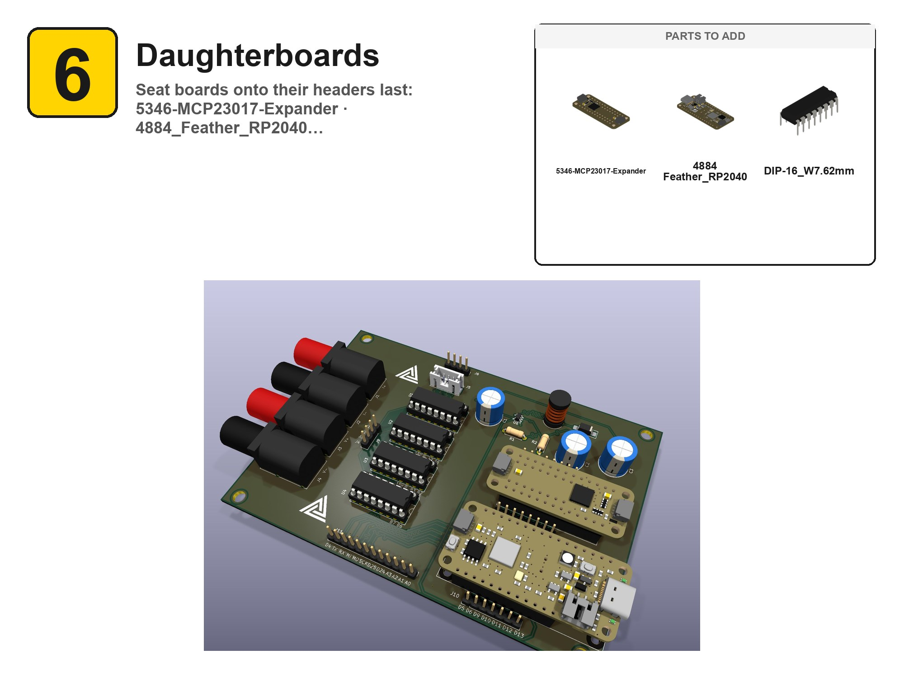
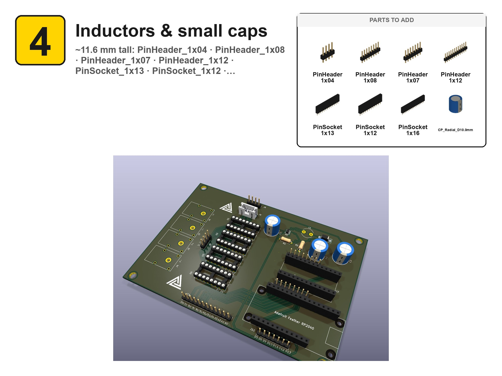

<div align="center">


# kibuilder

**Generate visual step-by-step assembly guides from a KiCAD PCB.**

[](https://doi.org/10.5281/zenodo.20683351)
[](LICENSE)

</div>

---

Given any `.kicad_pcb` and a small YAML config describing assembly stages, `kibuilder` produces a build guide where each step shows:

- the board after that step,
- a "parts to add" callout with high-quality OpenCASCADE renders of each new component (transparent backgrounds, real STEP colors), and
- numbered step badges + quantity tags in a clean toy-instruction style.

## Example output

A page from a guide generated for the [OpenPauw](https://github.com/nanosystemslab/OpenPauw) switching board — every image here came straight out of `kibuilder`, no manual editing:



Each stage pairs a "parts to add" callout (rendered from the real STEP models) with a cumulative render of the board after that step:



Output is one such page per stage, plus a combined landscape PDF and a GitHub-viewable `ASSEMBLY.md`.

## Pieces

- **`kibuilder render-parts`** — render each component STEP via OpenCASCADE V3d (the same renderer KiCAD uses), with transparent backgrounds and proper per-face colors from XCAF.
- **`kibuilder render-stages`** — render the cumulative board state for each assembly stage via `kicad-cli`.
- **`kibuilder build-guide`** — composite step-by-step assembly pages from the rendered parts + cumulative boards.
- **`kibuilder orient`** — small PyQt app for interactively tuning each component's display orientation, saved back to the config.

## Install (macOS, Homebrew)

The quickest way to get the app on a Mac:

```bash
brew install --cask mattnakamura/tap/kibuilder
```

This downloads the right build for your architecture (Apple Silicon or Intel), verifies it, and installs `kibuilder.app` into `/Applications`.

> [!IMPORTANT]
> **Known issue — Gatekeeper warning on first launch.** The current release is **not yet signed with an Apple Developer ID**, so on first launch macOS shows:
>
> > "kibuilder" can't be opened because Apple cannot check it for malicious software.
>
> Clear it once with:
>
> ```bash
> xattr -dr com.apple.quarantine /Applications/kibuilder.app
> ```
>
> Then open the app normally. This is a one-time step per install — it will go away entirely once the app is code-signed and notarized (planned; see [Status](#status)). On recent macOS the old right-click → **Open** bypass no longer works for unsigned apps, so the `xattr` command above is the reliable fix.

`kibuilder` needs KiCad's `kicad-cli` for the board renders — install KiCad too:

```bash
brew install --cask kicad
```

## Installing as a regular Python tool

Inside the env of your choice (pyenv-virtualenv works well — `cadquery-ocp` is large):

```bash
pip install -e .
kibuilder --verbose gui
```

Requires KiCad's `kicad-cli` on `PATH` for the cumulative-board renders. macOS path: `/Applications/KiCad/KiCad.app/Contents/MacOS/kicad-cli`.

## Building a macOS .app

For a double-clickable bundle that drops into `/Applications`:

```bash
pip install -e ".[build]"
scripts/build_app.sh                  # build dist/kibuilder.app
scripts/build_app.sh --clean          # nuke build/, dist/ first
scripts/build_app.sh --install        # also copy into /Applications/
```

The PyInstaller spec (`kibuilder.spec`) bundles the Python runtime, PyQt6, OpenCASCADE (~250 MB), and the kibuilder package into a single `.app`. Final bundle is ~450 MB.

**First launch:** the bundle is unsigned, so Gatekeeper will warn ("Apple cannot check it for malicious software"). Clear the quarantine flag once with `xattr -dr com.apple.quarantine dist/kibuilder.app` (or the `/Applications` copy), then open normally. See the [Homebrew install note](#install-macos-homebrew) for details — same fix applies.

**`kicad-cli` is not bundled** — it lives inside the KiCad install, which the user already needs for the project. The app detects it at startup and reports a clear error if missing.

## Running in GitHub Codespaces (zero local install)

Easiest path for anyone who can't or won't install Docker/Python/Qt locally. Open the repo on GitHub → **Code → Codespaces → Create codespace on main**. The container builds, KasmVNC starts on port 6901, and a browser tab auto-opens to the kibuilder GUI. Examples are pre-mounted at `/work/examples/openpauw`.

Works through corporate firewalls that block Docker but allow GitHub. Free tier covers ~60 hr/month per user.

Persistent state lives in the codespace — JPGs, PDFs, and `ASSEMBLY.md` you generate stay in the workspace and can be committed back via the built-in VS Code git UI.

## Running in Docker (browser GUI)

Zero local install — runs the full GUI inside a container with KiCad pre-installed, accessed via your browser through KasmVNC. Best when you want to demo kibuilder without setting up Python / KiCad / Qt on the host.

```bash
scripts/docker-run.sh                       # uses examples/openpauw
scripts/docker-run.sh /path/to/your/project # mount your own KiCad dir
# or, with compose:
KIBUILDER_PROJECT_DIR=/path/to/project docker compose up
```

Then browse to:

```
http://localhost:6901/
```

You'll see the kibuilder splash. The mounted host directory shows up inside the container at `/work` — open your project's `.kicad_pro` from there.

**Notes:**
- First build is ~5-10 min and produces a ~2 GB image (KiCad 9 + cadquery-ocp + KasmVNC).
- Browser GUI is delivered via [KasmVNC](https://github.com/kasmtech/KasmVNC) — modern Material-style web client, dynamic browser-resize, no extra plugins.
- Your project dir is the only mount; build artifacts (`media/assembly/`, `ASSEMBLY.md`, PDF) write back to the host so you can commit them.
- macOS Docker has no native GUI passthrough; KasmVNC's web client is the most portable option (no XQuartz needed). Linux hosts could alternatively forward `$DISPLAY` directly — the entrypoint will still work.

## Status

Early — pulled out of the OpenPauw project where the renderers were first developed. APIs will move.

**Roadmap:**
- **Code signing + notarization** — eliminates the Gatekeeper quarantine step above (blocked on an Apple Developer ID). The release CI already has the signing/notarization steps wired; they activate automatically once the signing secrets are added.
- Windows build is published but the V3d rendering path there is not yet runtime-verified.

## License

GPL-3.0-or-later (inherits OpenCASCADE's licensing constraints).
